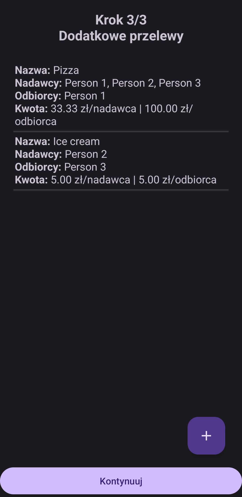

# Drzewka
My first encounter with phone app development (pre-college project).

# What is this?
It's an expense-splitting application (a bit like Splitwise).

It ensures that everyone has to make at most one bank transfer.

Me and my friends use it on our trips :)

# How does the app look like?

# What else could be done?
1. Refactoring code with newly gained knowledge.
2. Save & load feature (possibly using a cloud service).
3. Desgin polishing (especially result page).
